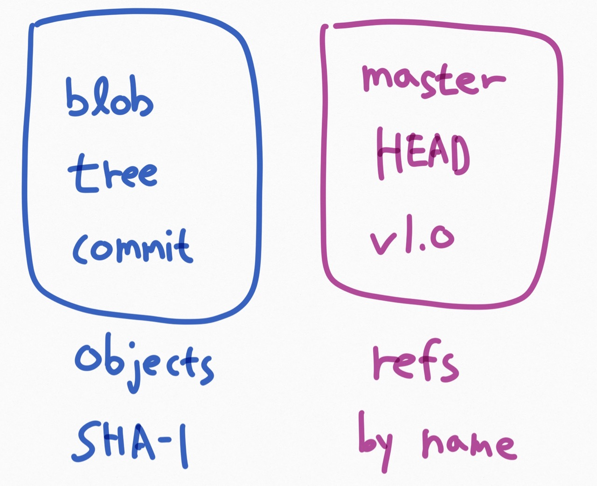

# Git 내부 구조를 알아보자 : 1부 - 기본 오브젝트

* Git 내부 구조를 알아보자는 글과 스크린캐스트
* 평소 Git의 내부를 더 알고 싶으셨거나, 무언가 Git을 이용한 소프트웨어를 개발하시려는 분들께 도움

## 0부: 프로젝트 소개

* [미디엄 글: Git 내부 구조를 알아보자 (0) 프로젝트 소개와 예고](https://medium.com/happyprogrammer-in-jeju/git-내부-구조를-알아보자-0-프로젝트-소개와-예고-bf3a8549f439)
* [유튜브 동영상: Git 내부 구조를 알아보자 (0) 예고](https://youtu.be/DWnrsbxhuOY)

## Git 저장소 디렉터리의 내용

* Git은 분산 버전 관리 시스템
* 한 프로젝트의 여러 저장소가 각각 독립적으로 완전한 데이터를 보유
* 원격 저장소 없이 로컬 저장소만으로도 버전 관리를 할 수도

> 지금부터 로컬에 직접 저장소를 하나 새로 만들어서 진행합니다.

``` bash
$ mkdir 저장소 && cd 저장소
$ git init
$ ls -p1 .git
HEAD
config
description
hooks/
info/
objects/
refs/
$ tree -a
```

* `.git/` 디렉터리에 git 저장소의 모든 내용
* `git init`로 초기화했지만, 별다른 내용이 들어 있지 않은 상태

## README.md 파일 추가

방금 만든 빈 저장소에 새로 파일을 추가합니다.

``` bash
$ echo '# 실험용 저장소' > README.md
$ cat README.md
$ git add README.md
```

* `.git/objects/8a/8363d93e61185f6df18ed61321626be514c7f4` 파일

## Git 기본: SHA-1 해시

* Git은 데이터를 저장하기 전에 항상 체크섬을 구하고 그 기준으로 데이터를 관리
* SHA-1 해시를 사용
  * 160 bits = 20 bytes
  * 16진수 문자열형태로 표현하면 40자

> 8a8363d93e61185f6df18ed61321626be514c7f4

* 앞의 몇 글자만 써도 대부분 달리 겹치지 않음

``` bash
$ git show 8a8363d93e61185f6df18ed61321626be514c7f4
$ git show 8a8363d
```

## 내용을 주소로 활용 (Content-addressable Key-Value Storage)

* Git은 내용을 주소로 활용하는 파일시스템(content-addressable filesystem)
* 내부는 사실 꽤 단순한 키-밸류 데이터베이스

## Plumbing & Porcelain

* 저수준(low-level)의 기본적인 일을 처리하는 plumbing 명령어
* 고수준(high-level)에서 사용자가 일반적으로 쓰는 porcelain 명령어


## 기본 오브젝트



## Blob 추가

``` bash
$ echo '# 실험용 저장소' > README.md
$ cat README.md | git hash-object --stdin
$ mv .git/objects/8a/8363d93e61185f6df18ed61321626be514c7f4 8a8363.bak
$ cat README.md | git hash-object -w --stdin
$ diff .git/objects/8a/8363d93e61185f6df18ed61321626be514c7f4 8a8363.bak
$ rm 8a8363.bak
```

## Blob 파일 내용

``` bash
$ cat .git/objects/8a/8363d93e61185f6df18ed61321626be514c7f4
$ file .git/objects/8a/8363d93e61185f6df18ed61321626be514c7f4
```

???

## zlib으로 압축해서 저장

* zlib은 무료로 공개된 압축 알고리즘이자 라이브러리

``` bash
$ ruby -rzlib -e 'print Zlib::Inflate.inflate(STDIN.read)' < .git/objects/8a/8363d93e61185f6df18ed61321626be514c7f4
blob 22# 실험용 저장소
$ ruby -rzlib -e 'p Zlib::Inflate.inflate(STDIN.read)' < .git/objects/8a/8363d93e61185f6df18ed61321626be514c7f4
"blob 22\x00# \xEC\x8B\xA4\xED\x97\x98\xEC\x9A\xA9 \xEC\xA0\x80\xEC\x9E\xA5\xEC\x86\x8C\n"
```

> blob 22#실험용 저장소

> "blob 22\x00# \xEC\x8B\xA4\xED\x97\x98\xEC\x9A\xA9 \xEC\xA0\x80\xEC\x9E\xA5\xEC\x86\x8C\n"

## 오브젝트 헤더

> blob_바이트수\0

* 각 오브젝트 헤더는, blob / tree / commit 등의 문자열로 시작
* 공백 문자
* 헤더를 제외한 본문의 바이트 수를 문자열 표기
* NULL(\0) 문자로 헤더의 끝


## 트리(tree) 오브젝트

* 파일 이름과 기본 속성, 그리고 어느 디렉터리에 속하는 지의 정보 기록
* `tree` 오브젝트는 __특정 시점의__ 디렉터리

``` bash
$ echo 'hatemogi at gmail' > AUTHOR
$ mkdir src
$ echo '(ns part1)' > src/part1.clj
$ git add AUTHOR src
$ git commit -m "첫번째 커밋"
```

> `0e7a2452ff7f8d53fada6e8375f2806121561fbe`

### tree: 0e7a245

    100644 blob 72d78def2dc72d0dce67f36874c55a7b3e6ccef7	AUTHOR
    100644 blob 8a8363d93e61185f6df18ed61321626be514c7f4	README.md
    040000 tree df447e88eca6d9b6648c3107aeb1ac352f4223d1	src

### tree: df447e8

    100644 blob ff711af123f4a4fd3ce1f39fec84d7f0ee0dce16	part1.clj

### tree 저장 포맷

> tree_바이트수\0

> 타입_파일명\0오브젝트ID

* `타입`: `100644`, `100755`, `040000`
* 공백 문자
* 파일명: NULL로 끝나는 문자열
* SHA1 해시값: 20 바이트 바이너리

## 오브젝트 내용을 편하게 보기

``` bash
$ git cat-file -t 8a8363d
$ git cat-file -p 0e7a245
```

## 클로저 프로젝트 개발 예정

> `git hash-object`와 `git cat-file` 명령어를 소스코드 수준에서 작성해 보고 테스트할 예정

    https://github.com/hatemogi/git-internals (작성예정)

## 2부에 계속

커밋과, 그 커밋을 가리키는 레퍼런스에 대해 알아보겠습니다

공유/댓글/추천/구독!
